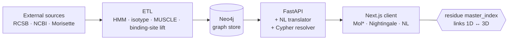

# Architecture / data-flow diagram

The Mermaid source below renders the full data flow from external sources
through the ETL pipeline, into the Neo4j graph, out via the FastAPI
backend, and into the Next.js + Mol* + Nightingale frontend with the
natural-language layer.

Render with:

```
npx -y @mermaid-js/mermaid-cli -i poster/architecture_diagram.md -o poster/architecture.svg
```

(The CLI extracts the fenced ```mermaid block automatically.)

## Full pipeline

```mermaid
flowchart LR

    %% =========== INGEST ===========
    subgraph INGEST [Data sources]
        direction TB
        RCSB_SEARCH["RCSB Search API<br/>InterPro IPR000217<br/>~800 structures"]
        RCSB_GQL["RCSB GraphQL<br/>entity metadata,<br/>UniProt, organism"]
        CIF["CIF coordinates"]
        TAX["NCBI taxonomy<br/>via ete3"]
        MORI["Morisette 2023 CSVs<br/>~5.2k variants<br/>~1.95k modifications"]
        UTN["UTN consensus<br/>(Suppl. Table S1)"]
    end

    %% =========== ETL ===========
    subgraph ETL [ETL pipeline - 5 phases]
        direction TB
        P1["1. Acquire raw data"]
        P2["2. HMM family classification<br/>α / β / γ / δ / ε / 39 MAP families"]
        P25["2.5. Isotype calling<br/>tier 1: UniProt lookup<br/>tier 2: alignment ≥85 percent"]
        P3["3. MUSCLE profile alignment<br/>vs per-family master MSA<br/>+ variant calling"]
        P4["4. Binding-site augmentation<br/>auth_seq_id → master_index"]
        P5["5. Assemble + persist<br/>TubulinStructure JSON"]
    end

    %% =========== STORE ===========
    subgraph STORE [Storage]
        NEO[("Neo4j graph<br/>Structure / Entity / Instance<br/>Variant / Modification<br/>Chemical / Phylogeny")]
        DISK["Disk: per-structure<br/>profile JSON + thumbnail"]
    end

    %% =========== API ===========
    subgraph API [FastAPI backend]
        direction TB
        ROUTE_S["/structures"]
        ROUTE_P["/polymers"]
        ROUTE_L["/ligands"]
        ROUTE_M["/msa"]
        ROUTE_A["/annotations"]
        ROUTE_NL["/nl_query<br/>(global, viewer, filters)"]
        NL_TRANS["NL translator<br/>+ Cypher resolver<br/>(no LLM-authored IDs)"]
    end

    %% =========== FRONTEND ===========
    subgraph FRONT [Next.js frontend]
        direction TB
        MOLSTAR["Mol* 3D viewer<br/>custom presets<br/>family-aware colouring"]
        NGT["Nightingale MSA<br/>two-tier colouring<br/>variant / PTM overlays"]
        REDUX["Redux + RTK Query<br/>codegen from OpenAPI"]
        NL_UI["NL chat input<br/>action cards<br/>URL deep-linking"]
        SYNC{{"1D ↔ 3D sync<br/>master_index"}}
    end

    %% --- INGEST -> ETL ---
    RCSB_SEARCH --> P1
    RCSB_GQL --> P1
    CIF --> P1
    TAX --> P2
    P1 --> P2
    P2 --> P25
    P25 --> P3
    P3 --> P4
    P4 --> P5
    MORI --> UTN
    UTN -. UTN map .-> P3
    UTN --> NEO

    %% --- ETL -> STORE ---
    P5 --> DISK
    DISK --> NEO

    %% --- STORE -> API ---
    NEO --> ROUTE_S
    NEO --> ROUTE_P
    NEO --> ROUTE_L
    NEO --> ROUTE_M
    NEO --> ROUTE_A
    NEO --> NL_TRANS
    NL_TRANS --> ROUTE_NL

    %% --- API -> FRONT ---
    ROUTE_S --> REDUX
    ROUTE_P --> REDUX
    ROUTE_L --> REDUX
    ROUTE_M --> NGT
    ROUTE_A --> NGT
    ROUTE_NL --> NL_UI

    %% --- FRONT internals ---
    REDUX --> MOLSTAR
    REDUX --> NGT
    MOLSTAR <--> SYNC
    NGT <--> SYNC
    NL_UI -. action cards .-> REDUX
    NL_UI -. deep-linked URL .-> MOLSTAR

    classDef external fill:#f5f5f5,stroke:#888,color:#333,stroke-width:1px
    classDef pipe fill:#fff7e6,stroke:#d48806,color:#333,stroke-width:1px
    classDef store fill:#e6f4ff,stroke:#1677ff,color:#333,stroke-width:1px
    classDef api fill:#f6ffed,stroke:#52c41a,color:#333,stroke-width:1px
    classDef front fill:#fff0f6,stroke:#c41d7f,color:#333,stroke-width:1px

    class RCSB_SEARCH,RCSB_GQL,CIF,TAX,MORI,UTN external
    class P1,P2,P25,P3,P4,P5 pipe
    class NEO,DISK store
    class ROUTE_S,ROUTE_P,ROUTE_L,ROUTE_M,ROUTE_A,ROUTE_NL,NL_TRANS api
    class MOLSTAR,NGT,REDUX,NL_UI,SYNC front
```



## Compact "moving parts" overview (alternative, for smaller poster space)

If the full diagram doesn't fit, the compact version below collapses the
ETL stages and the API routes:



## Notes for the designer

- The full diagram fits comfortably in an A2 panel ~35 cm wide if rendered
  in SVG. Read left-to-right; vertical stacking within each subgraph.
- Use colour-coding consistently:
  - external sources: light grey
  - ETL pipeline: warm yellow
  - storage: cool blue
  - API: green
  - frontend: pink/magenta
- The `1D ↔ 3D sync` node should be drawn prominently, possibly as a
  highlighted hub between Mol* and Nightingale, since this is the
  central UX claim.
