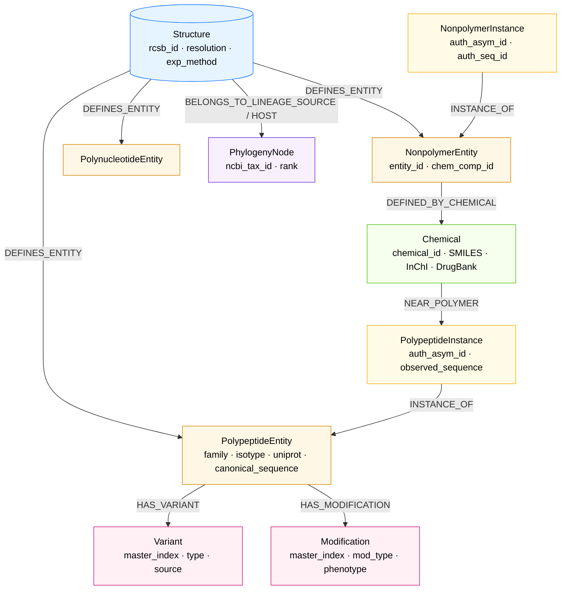

# Database overview

The poster panel showing what is in the database and how it is organised.
Two parts:

1. A counts table (what's in there, where it came from, how much).
2. A simplified Neo4j graph schema (Mermaid).

Render the schema with:

```
npx -y @mermaid-js/mermaid-cli -i poster/database_overview.md -o poster/database.svg
```

## Counts table

| Layer | Content | Source | Count |
|---|---|---|---|
| Structures | tubulin-containing PDB entries | RCSB Search API (InterPro **IPR000217**) | ~800 |
| Tubulin families represented | α, β, γ, δ, ε *(ζ has no experimental structures; Findeisen et al. 2014)* | HMM classification | 5 of 6 |
| MAP / modifying-enzyme families | EBs, kinesins (-1/-5/-13), dynein, katanin, CKAP5, TPX2, TTL, tau, MAP2/4/7, PRC1, CAMSAPs, vasohibin–SVBP, ATAT1, TTLLs, CCPs, … | HMM classification | 39 |
| Human α/β isotypes | TUBA1A–TUBA8, TUBB1–TUBB8 | UniProt + alignment fallback | 16 |
| Structural variants | substitutions, insertions, deletions vs. master consensus | MUSCLE profile alignment | per-entity |
| Literature mutations | clinical + model-organism missense variants | **TubulinDB** (Abbaali et al. 2023, *PLoS ONE* 18(12): e0295279) | ~5,200 |
| Literature modifications | tubulin-body PTMs (acetylation αK40, methylation αK40, phosphorylation βS172/αY432, polyamination βQ15, ubiquitinylation αK304, palmitoylation αK376, sumoylation) and C-terminal-tail PTMs (tyrosination/detyrosination, polyglutamylation, polyglycylation, Δ2/Δ3-tubulin) | TubulinDB + Janke & Magiera 2020 (*NRMCB* 21, 307–326) | ~1,950 |
| Ligand binding sites | per-structure residue contacts | Mol* (headless) → master-alignment lift | per-structure |
| Taxonomy | NCBI lineage paths (source + host) | NCBI / ete3 | ~hundreds |

## Neo4j graph schema (simplified)



## Key indexes / constraints

Highlight these next to the schema:

- `Structure.rcsb_id` **UNIQUE**
- `(PolypeptideEntity.parent_rcsb_id, entity_id)` **UNIQUE**
- `(PolypeptideInstance.parent_rcsb_id, asym_id)` **UNIQUE**
- `Chemical.chemical_id` **UNIQUE**
- `PhylogenyNode.ncbi_tax_id` **UNIQUE**
- `Variant.master_index` **INDEXED**
- `Modification.master_index` **INDEXED**

## The join key

A short callout next to the schema:

> *`master_index` is the join key that makes the atlas work.* Every
> variant, modification, ligand-binding contact, and inter-protein
> contact is stored as a position in its family's master alignment.
> A single Cypher query of the form
>
> ```
> MATCH (v:Variant {master_index: 246, family: 'tubulin_beta'})
> ```
>
> returns clinical mutations, structural variants, and PTM annotations
> at the equivalent residue across the entire β-tubulin dataset, no
> matter which PDB structure or which species the data came from.

## Example queries (optional sidebar)

Three short Cypher snippets to demonstrate what the schema enables —
useful as a sidebar if there is room:

```
// All structures containing β-tubulin from Toxoplasma gondii
MATCH (s:Structure)-[:DEFINES_ENTITY]->(e:PolypeptideEntity)
WHERE e.family = 'tubulin_beta' AND 5811 IN e.src_organism_ids
RETURN s.rcsb_id, s.resolution ORDER BY s.resolution ASC
```

```
// Every PDB structure where the taxane-site ligand TA1 contacts a polymer
MATCH (c:Chemical {chemical_id: 'TA1'})-[r:NEAR_POLYMER]->(i:PolypeptideInstance)
RETURN i.parent_rcsb_id, i.auth_asym_id, r.contact_residue_count
```

```
// All known modifications at β-tubulin master position 40 (lysine acetylation)
MATCH (e:PolypeptideEntity {family:'tubulin_alpha'})-[:HAS_MODIFICATION]->(m:Modification)
WHERE m.master_index = 40
RETURN DISTINCT m.mod_type, m.species, m.phenotype
```
